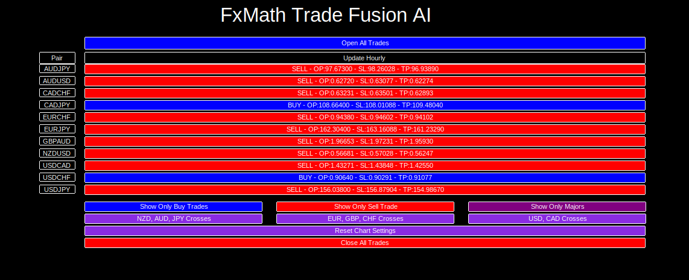

# What is FxMath Trade Fusion AI?
FxMath Trade Fusion AI is a state-of-the-art trading system designed for the modern forex trader. It’s not just another EA—it’s a game-changer. Built specifically for the MT5 platform, FxMath Trade Fusion AI uses advanced AI and ML algorithms to analyze market data, identify high-probability trading opportunities, and execute trades with precision. Whether you’re a beginner or an experienced trader, this tool is your gateway to smarter, more profitable trading.

